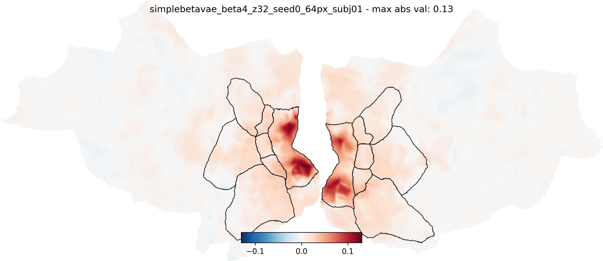

## what

- fork of: https://github.com/adriendoerig/visuo_llm.git
- exploratory replication-ish
- run fully on [this PC](https://pcpartpicker.com/list/4KpcH3)
- mostly dealing with RAM bottleneck!

## results

### searchlight correlations

- Pearson correlation of model RDM vs brain RDM for each voxel
- voxel RDMs calculated in searchlight manner (6 voxel radius sphere centered on each voxel)
- see [paper](https://www.nature.com/articles/s42256-025-01072-0#Sec7) for details

**subject 1, 20 sessions, 25 sampled 100x100 RDMs:**

custom mini beta VAE trained on MS COCO 2014 train set


mpnet base v2


**subject 1, 10 sessions, 8 sampled 100x100 RDMs:**


## Citation

```bibtex
@article{doerig2024visualrepresentationshumanbrain,
      title={Visual representations in the human brain are aligned with large language models},
      author={Adrien Doerig and Tim C Kietzmann and Emily Allen and Yihan Wu and Thomas Naselaris and Kendrick Kay and Ian Charest},
      year={2024},
      eprint={2209.11737},
      archivePrefix={arXiv},
      primaryClass={cs.CV},
      url={https://arxiv.org/abs/2209.11737},
}
```
