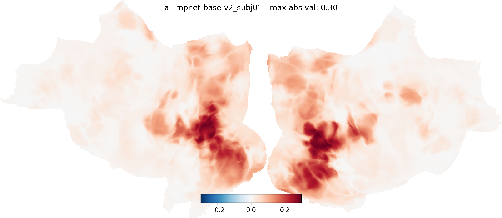
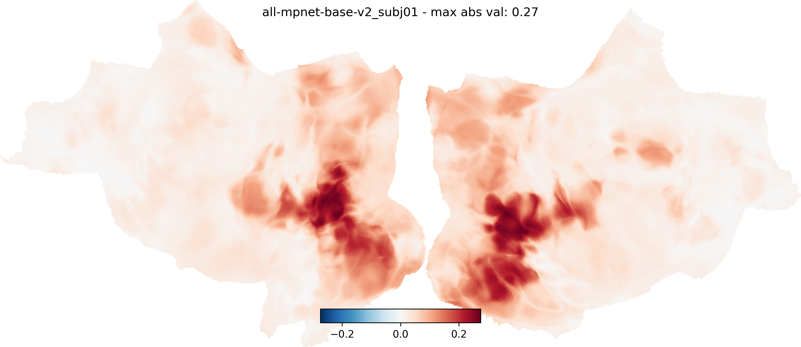

## what

- fork of: https://github.com/adriendoerig/visuo_llm.git
- exploratory replication-ish
- trying to run on some other datasets
- run fully on this PC: https://pcpartpicker.com/list/PggT34
- mostly dealing with RAM bottleneck!

## results

**subject 1, 20 sessions, 25 sampled 100x100 RDMs:**


**subject 1, 10 sessions, 8 sampled 100x100 RDMs:**


## Citation

```bibtex
@article{doerig2024visualrepresentationshumanbrain,
      title={Visual representations in the human brain are aligned with large language models},
      author={Adrien Doerig and Tim C Kietzmann and Emily Allen and Yihan Wu and Thomas Naselaris and Kendrick Kay and Ian Charest},
      year={2024},
      eprint={2209.11737},
      archivePrefix={arXiv},
      primaryClass={cs.CV},
      url={https://arxiv.org/abs/2209.11737},
}
```
